# 接入飞书 / Lark

跟着下面的步骤做完，你就能在飞书 / Lark 里和 Goldpan 对话。

> **飞书（中国版）和 Lark（国际版）是两套独立的系统**，用哪个看你的团队在哪。中国大陆团队去 [open.feishu.cn](https://open.feishu.cn/app)，海外团队去 [open.larksuite.com](https://open.larksuite.com/app)。两边账号互不通用。

## 准备

- 一个飞书 / Lark 的**企业 / 团队管理员**账号（个人账号也能创建，但只能在自己的企业里用）。
- Goldpan 已经能在你电脑上启动（`pnpm dev` 或 `pnpm start` 能跑起来）。
- 能编辑 `.env` 文件。

## 步骤 1：创建一个企业自建应用

1.1 进 [飞书开放平台](https://open.feishu.cn/app)，点 **创建应用** → **从空白开始** → **创建企业自建应用**。

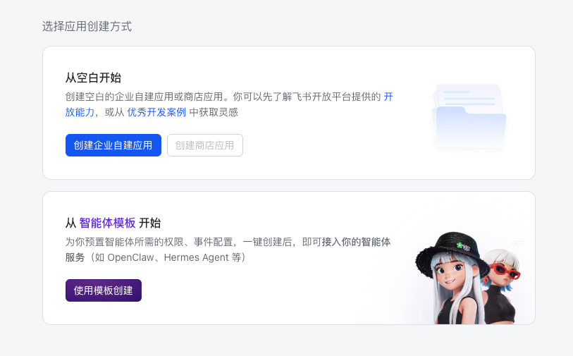

1.2 填 **应用名称**、**应用描述**、**应用图标**（建议 512×512 起步），点 **创建**。

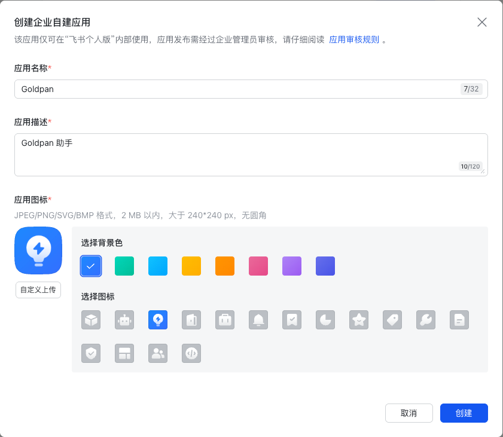

## 步骤 2：开启机器人能力

2.1 左侧导航 → **添加应用能力** → 找到 **机器人** 卡片，点 **添加**。

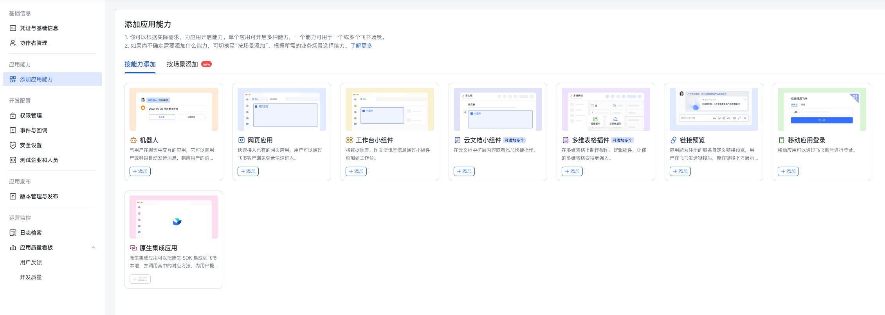

2.2 添加成功后，左侧导航会多一个 **机器人** 菜单。

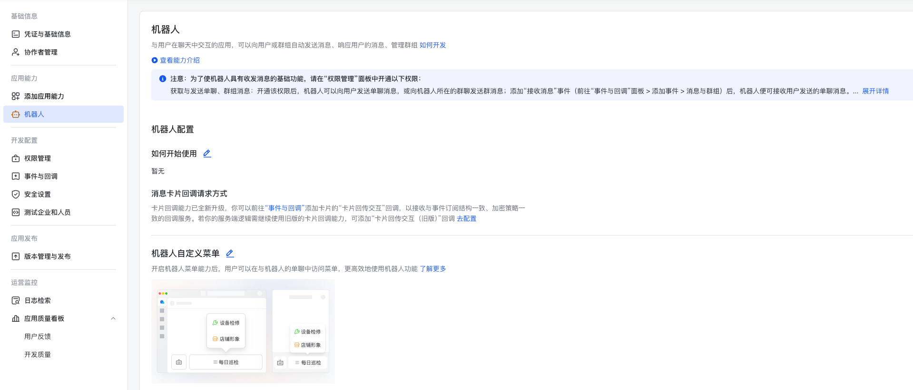

## 步骤 3：拿到 App ID 和 App Secret

1. 左侧导航 → **凭证与基础信息**。
2. 复制 **App ID**（形如 `cli_a1b2c3d4e5f6g7h8`）和 **App Secret**（一长串混合字符）。
3. **App Secret 当作密码保管**，泄漏了立刻在这个页面 **重置 Secret**，重置后旧值立刻作废，记得更新 `.env` 并重启。

## 步骤 4：申请权限

左侧导航 → **权限管理** → **批量导入权限**，把下面这段贴进去，点 **下一步，确认新增权限**：

```jsonc
{
  "scopes": {
    "tenant": [
      "admin:app.info:readonly",
      "application:application:self_manage",
      "im:chat",
      "im:chat:read",
      "im:chat:readonly",
      "im:message",
      "im:message.group_at_msg:readonly",
      "im:message.p2p_msg:readonly",
      "im:message:send_as_bot"
    ],
    "user": [
      "admin:app.info:readonly"
    ]
  }
}
```

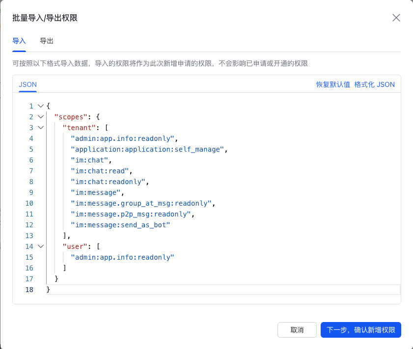

> 截图里如果有多余的权限项是历史残留，**以上面这段 JSON 为准**。
>
> **不要再加 `im:message.group_msg:readonly`**：这个权限会让机器人收到群里**所有人**的全部消息，需要管理员审批，而且 Goldpan 在群里只会响应 @机器人 / `/` 命令 / 回复机器人这三类消息，加了也没用。

## 步骤 5：开启长连接 + 订阅事件 + 订阅回调

左侧导航 → **事件与回调**。这个页面下有**两个 tab**：**事件配置** 和 **回调配置**，下面要在两个 tab 里各添加一项。

### 5.1 选订阅方式

切到 **事件配置** tab → 点 **订阅方式** 旁边的笔图标 → 选 **使用长连接接收事件** → 保存。

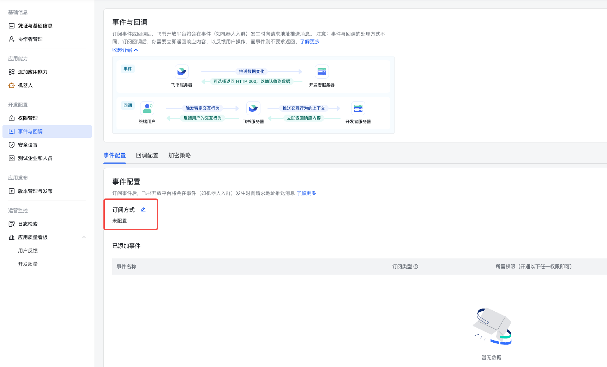

> 选了长连接你就**不用**再配什么回调 URL、域名、SSL 证书，Goldpan 会自己跟飞书建立连接。

> **加密策略保持不开**就好。如果你确实开了 Encrypt Key，把后台显示的值复制到 `.env` 里的 `GOLDPAN_IM_FEISHU_ENCRYPT_KEY`。**不要写 `KEY=` 留空**，不然启动会失败 —— 没开就完全把这一行删掉 / 注释掉。

### 5.2 在「事件配置」里添加事件

还在 **事件配置** tab，点 **添加事件**。

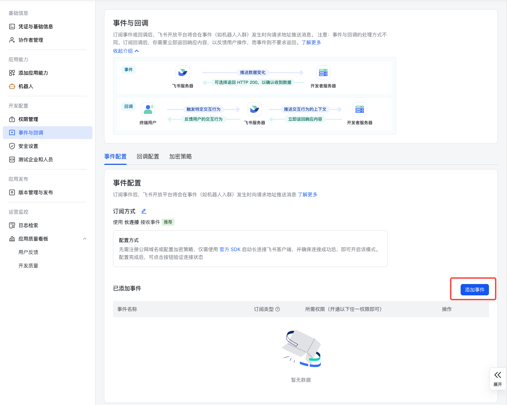

搜 `receive_v1`，勾上 **接收消息 v2.0**，点 **添加**。

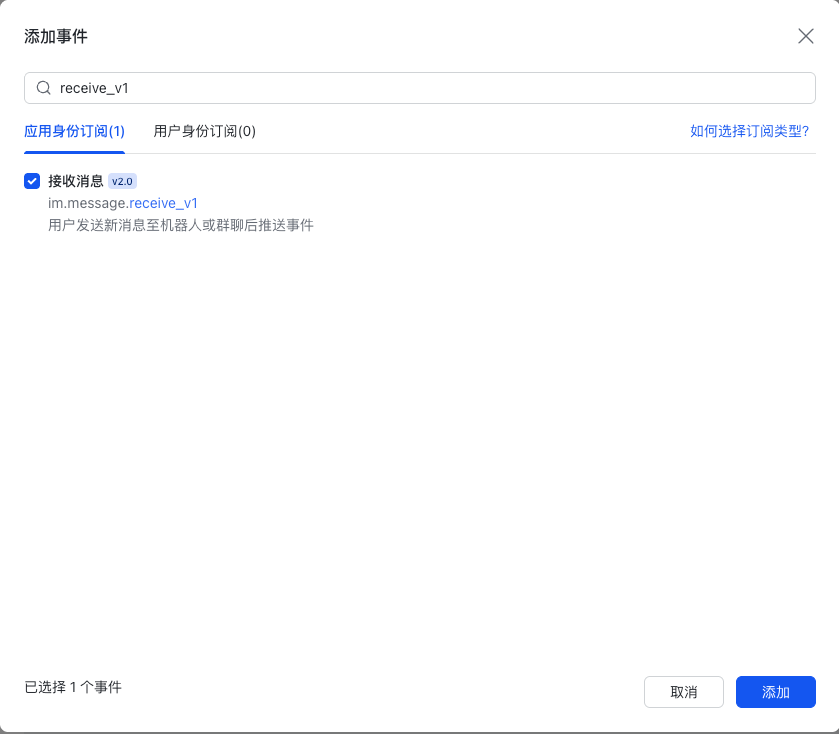

### 5.3 切到「回调配置」tab 添加回调

> **找不到 `卡片回传交互` / `card.action.trigger` 99% 的原因是没切 tab** —— 它在 **回调配置** 里，不在 **事件配置** 里。

切到 **回调配置** tab，点 **添加回调**。

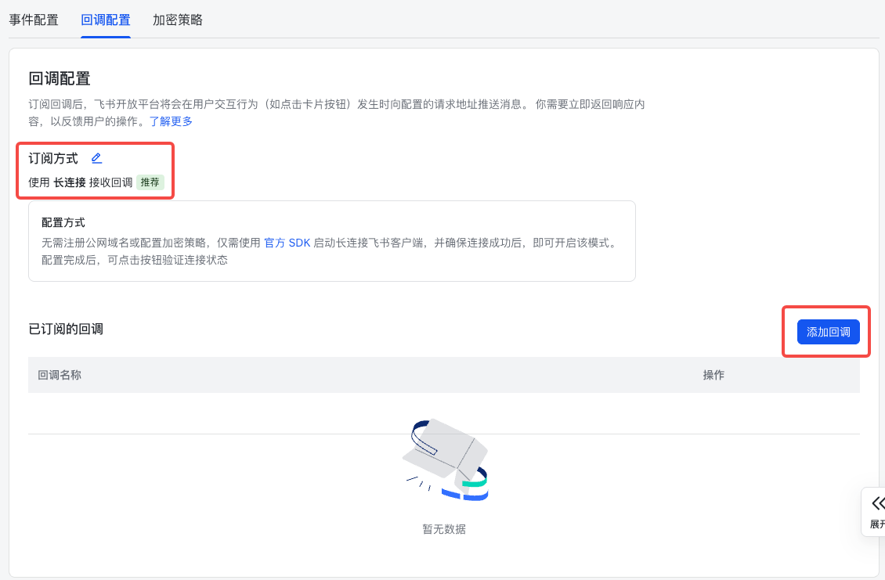

搜 `卡片回传交互`，勾上，点 **添加**。

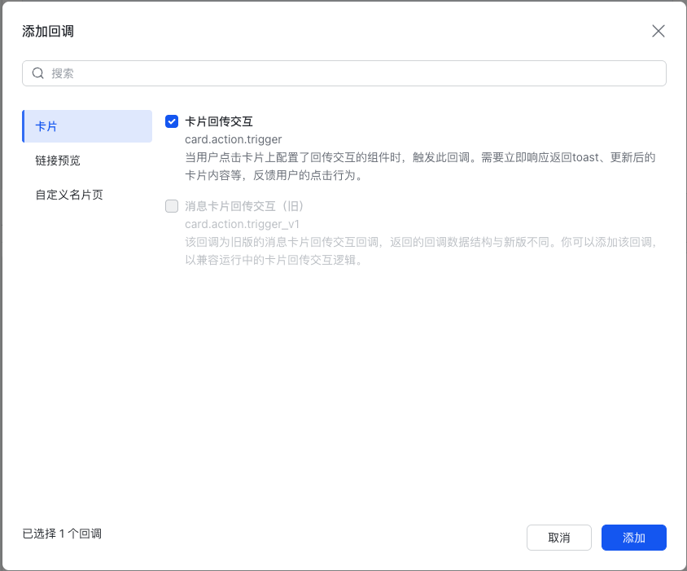

> 如果搜不到 `卡片回传交互`：回 **添加应用能力 → 机器人** 页面，确认互动卡片 / 消息卡片开关已经打开。

### 5.4 配置顺序提示

保存事件 / 回调订阅时，飞书会要求 Goldpan 已经启动好（它要发一次校验消息过来），不然会报"未建立长连接"。如果你第一次配遇到这个错，按这个顺序走：

1. 先做完 5.1（选长连接）。
2. 跳到步骤 7、8 把 Goldpan 启动起来。
3. 启动好之后再回 5.2、5.3 添加事件 + 回调并保存。
4. 最后到步骤 6 发布版本。

## 步骤 6：创建并发布版本（**必须做**，不发布机器人不工作）

飞书自建应用必须进入"已发布"状态，前面配的权限和事件订阅才会真的生效。配置页面顶部会一直挂着 `应用发布后，当前配置方才生效` 的提示。

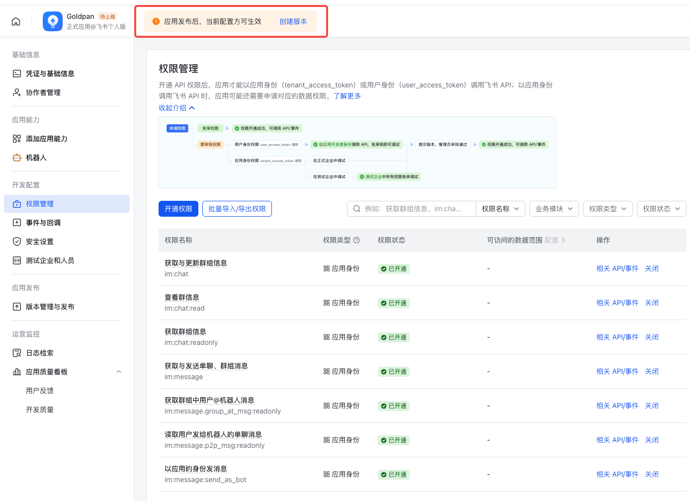

1. 左侧导航 → **版本管理与发布** → **创建版本**。
2. 填 **版本号**（首次填 `1.0.0`）、**版本说明**，**可用范围** 只勾要用 bot 的成员 / 部门（**不要选"全员可用"**，避免别人也能用）。
3. 点 **保存并发布**。
4. 企业内自建应用一般免审核、自动通过；如果你的企业开了应用审批，要等管理员批准。

> **以后每次改权限或事件订阅，都得重新创建一次新版本并重新发布**，新配置才会生效。这是飞书的规则。

## 步骤 7：填 `.env`

打开 `.env`，找到 `Feishu` 这一段：

```bash
# 必填：步骤 3 复制的 App ID
GOLDPAN_IM_FEISHU_APP_ID=<你的_app_id>

# 必填：步骤 3 复制的 App Secret
GOLDPAN_IM_FEISHU_APP_SECRET=<你的_app_secret>

# 中国版填 feishu.cn（默认值就是这个），国际版（Lark）填 larksuite.com
GOLDPAN_IM_FEISHU_DOMAIN=feishu.cn

# 仅在步骤 5.1 你确实开了加密策略时才填；没开就完全注释掉这一行
# GOLDPAN_IM_FEISHU_ENCRYPT_KEY=
```

## 步骤 8：启动 + 验证

```bash
pnpm dev      # 或 pnpm start
```

启动好之后，在飞书 / Lark 联系人里搜你的应用名，找到机器人，点 **聊一聊**，发一句 `你好`。bot 会回复你（首次回复要等几秒）。

也可以发 `/start`、`/help`、`/reset` 试试这些内置命令。

## 群里 bot 不会回每条消息

把 bot 拉进群之后，bot 只会回应这三种消息：

- 以 `/` 开头的命令，比如 `/help`。
- 显式 @机器人 的消息。
- 你用飞书原生 **回复（reply）** 功能回复 bot 之前发的消息。

其它群里闲聊不会被处理，这是故意的设计。

## 谁能用这个 bot？看"可用范围"

飞书自建应用没有"白名单填几个用户 ID"的开关，**用步骤 6 发布版本时的"可用范围"控制谁能用**：

- 别选"全员可用"，只勾你想给的成员 / 部门 / 群。
- 改"可用范围"也得重新发布新版本才生效。
- 想做"我自己能用、别人都不行"的强隔离，最干净的办法是单独建一个只有你的部门或群，把 bot 可用范围限到那里。

## 常见问题

**搜不到 `卡片回传交互` / `card.action.trigger`**
它不是事件，是**回调**。先切到 **回调配置** tab 再搜。还搜不到的话，回 **添加应用能力 → 机器人**，把互动卡片 / 消息卡片开关打开。

**bot 不回话，但启动没报错**
按顺序排查：①飞书后台 **版本管理与发布** 状态是不是"已发布"？没发布前面配的都不生效。②你的账号是不是在该版本"可用范围"里？③在群里要 @机器人 才会触发。

**启动报错 `failed to fetch bot identity`**
App ID / Secret 错了，或者步骤 6 没发布版本。改完再启动。

**改了权限或事件订阅，bot 行为没变**
飞书的权限和事件订阅是**版本快照**，必须重新创建版本并发布才生效。

**`GOLDPAN_IM_FEISHU_ENCRYPT_KEY=` 写空字符串启动失败**
要么填实际的 Encrypt Key，要么完全把这一行删掉 / 注释掉。**不要留 `KEY=` 这种空赋值**。

**只填了 App ID 没填 Secret（或反过来）**
两边必须都填。一边空着 Goldpan 会直接不启动飞书机器人，等于没接入。

**bot 中文回复但我想英文（或反过来）**
改 `.env` 里的 `GOLDPAN_LANGUAGE`（`en` 或 `zh`），重启。

**App Secret 不小心泄漏了**
立刻去飞书开放平台 → **凭证与基础信息** → **重置 App Secret**，把新 Secret 写回 `.env` 重启。重置即时生效，旧 Secret 立刻作废。

## 不想手动改 .env？用 onboarding 向导

```bash
pnpm onboard          # 浏览器里点点配（推荐）
pnpm onboard:cli      # 纯命令行配
```

在向导的 IM 步骤里填 App ID / App Secret / Domain，向导会帮你写进 `.env`，效果跟手动编辑一样。**但飞书后台那边的步骤 1～6 还得你手动做**，向导帮不了。
