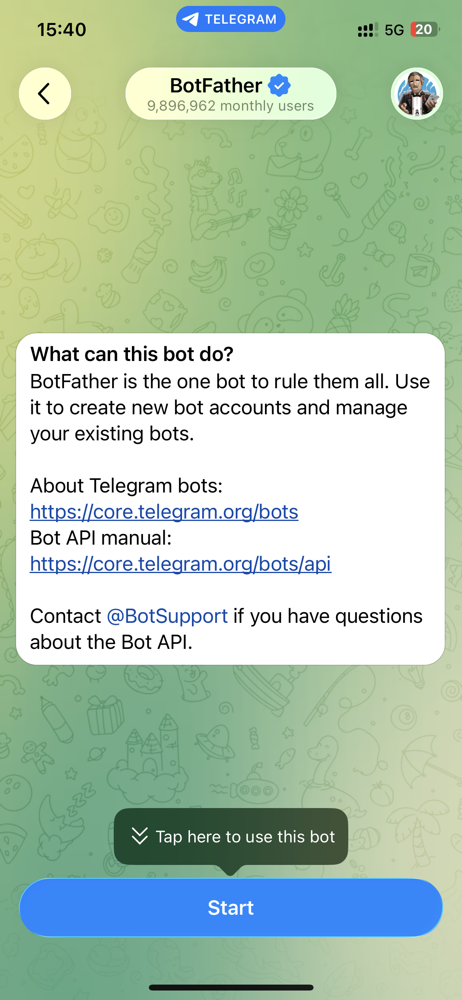
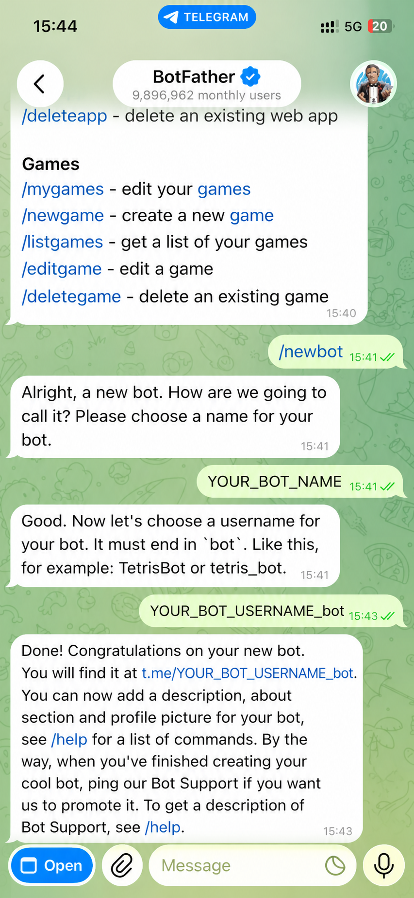
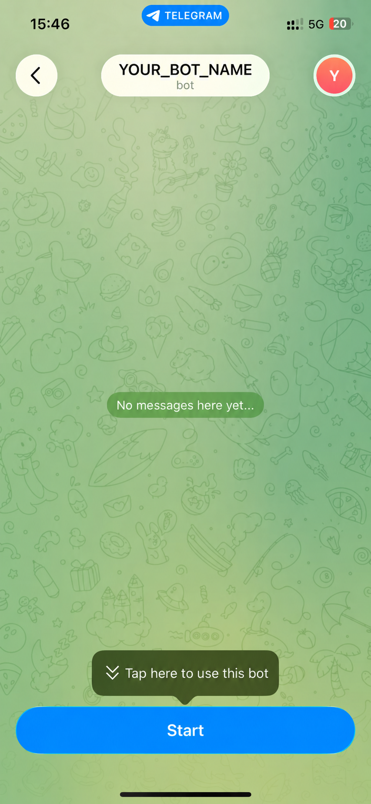
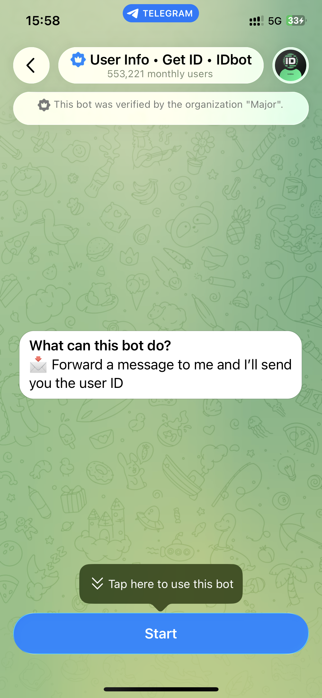
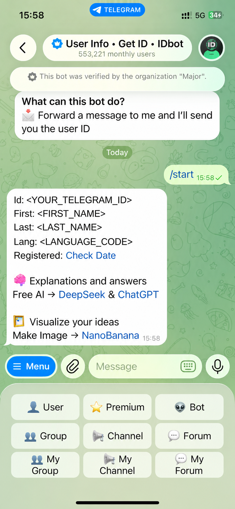

# 接入 Telegram

跟着下面 4 步做完，你就能在 Telegram 里和 Goldpan 对话。

## 准备

- 一个 Telegram 账号。
- Goldpan 已经能在你电脑上启动（`pnpm dev` 或 `pnpm start` 能跑起来）。
- 能编辑 `monorepo/.env` 文件（首次部署可从 `monorepo/.env.example` 复制一份）。

## 步骤 1：用 BotFather 创建一个 bot

1.1 在 Telegram 搜索 `@BotFather`（带蓝色认证勾的官方账号），点 **Start**。



1.2 发 `/newbot`，按提示填 **Display name**（聊天里显示的名字）和 **username**（必须以 `bot` 结尾且全网唯一）。成功后 BotFather 会回一条形如 `123456789:ABCdef...` 的 token —— **当作密码保管**，泄漏了去 BotFather 发 `/revoke` 重置。



1.3 在 Telegram 顶部搜索框里搜你刚才设置的 username，找到自己的 bot。


1.4 点进去会看到 **Start** 按钮。先**别**点，下一步要拿你的 chat ID 再回来。



## 步骤 2：拿到自己的 chat ID

Goldpan 默认只允许你指定的人跟 bot 对话，其他人发消息会被忽略。所以你得先拿到自己的 chat ID（一串数字），加到白名单里。

2.1 在 Telegram 搜 `@userinfobot`（认证账号 `User Info • Get ID • IDbot`）。


2.2 点进去 → **Start**。



2.3 它会立刻回你一条消息，里面 `Id:` 后面那串数字就是你的 chat ID，记下来。



### 想让某个群里也能用 bot？（可选，可跳过）

如果你只想自己 1 对 1 跟 bot 对话，**这一节直接跳过，进步骤 3**。

如果你想把 bot 拉进群、让群里的人也能用，那除了自己的 chat ID 之外，还得再拿一个**群的 chat ID**：

1. 把 bot 加进目标群。
2. 在群里 @ 一下 bot 或者发个 `/start`。
3. 浏览器打开下面这个链接（把 `<TOKEN>` 换成 BotFather 给的 token）：
   ```
   https://api.telegram.org/bot<TOKEN>/getUpdates
   ```
4. 在返回的内容里找 `"chat":{"id": ...}`，那个数字就是群的 chat ID。普通群形如 `-123456789`，超级群形如 `-1001234567890`，**前面的负号和 `-100` 要原样保留**。

> 如果链接打开返回是空的，把 Goldpan 服务先关掉再试一次。

> 步骤 3 填白名单时把**自己的 chat ID 和群的 chat ID 都写上**（用英文逗号分隔），就能同时支持私聊和群聊。

## 步骤 3：填 `monorepo/.env`

打开 `monorepo/.env`，找到 `Telegram` 这一段，填进两项：

```bash
# 必填：BotFather 给的 token
GOLDPAN_IM_TELEGRAM_BOT_TOKEN=123456789:ABCdefGhIJKlmNoPQRstuvwxYZ-1234567890

# 必填：步骤 2 拿到的 chat ID。多个用英文逗号分隔，可以同时放私聊 ID 和群 ID
GOLDPAN_IM_TELEGRAM_ALLOWED_CHAT_IDS=123456789,-1001234567890
```

## 步骤 4：启动 + 验证

```bash
cd monorepo
pnpm dev      # 或 pnpm start
```

启动完之后，在 Telegram 里跟 bot 私聊（或在群里 @bot）发一句 `你好`。bot 会回复你（首次回复要等几秒）。

也可以发 `/start`、`/help`、`/reset` 试试这些内置命令。

## 群里 bot 不会回每条消息

把 bot 拉进群之后，bot 只会回应这三种消息：

- 以 `/` 开头的命令，比如 `/help`、`/start`。
- 显式 @bot 的消息，比如 `@your_bot_name 帮我搜一下 xxx`。
- 你用 Telegram 的 **reply** 功能回复 bot 之前发的消息。

其它群里闲聊不会被处理，这是故意的设计，不是 bug。

## 常见问题

**bot 不回话，但我看启动没报错**
你的 chat ID 可能没加到白名单里。回步骤 2 重新拿 chat ID，确认 `GOLDPAN_IM_TELEGRAM_ALLOWED_CHAT_IDS` 里有它（私聊用自己的 user ID，群用群 ID 含负号），保存重启。

**启动报错 `allowlist is required`**
你设了 token 但没设白名单。把至少一个 chat ID 填进 `GOLDPAN_IM_TELEGRAM_ALLOWED_CHAT_IDS` 再重启。

**群组 ID 该填正数还是负数？**
负数。`-` 号必须保留。超级群还要带 `-100` 前缀（例如 `-1001234567890`）。

**bot 中文回复但我想英文（或反过来）**
改 `.env` 里的 `GOLDPAN_LANGUAGE`（`en` 或 `zh`），重启。

**Token 不小心泄漏了**
立刻去 BotFather → `/mybots` → 选你的 bot → **API Token** → **Revoke current token**，把新 token 写回 `.env` 重启。旧 token 立刻作废。

## 不想手动改 .env？用 onboarding 向导

```bash
cd monorepo
pnpm onboard          # 浏览器里点点配（推荐）
pnpm onboard:cli      # 纯命令行配
```

在向导的 IM 步骤里填 token 和 chat ID，向导会帮你写进 `.env`，效果跟手动编辑一样。
